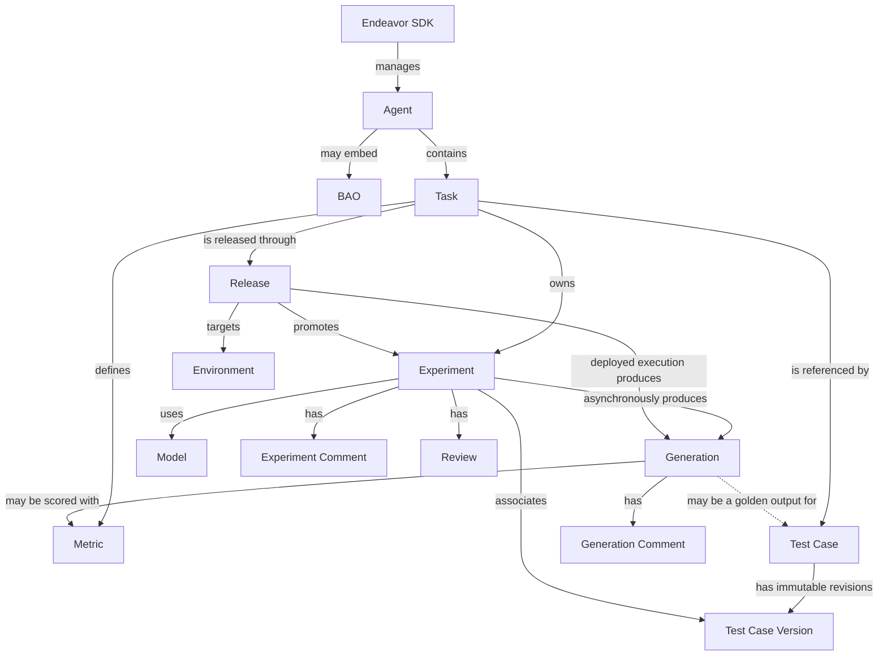

# Core concepts

[Documentation home](README.md) · [Getting started](getting-started.md) ·
[Execution](execution.md) · [Lifecycle](lifecycle.md)

## Resource graph

The graph distinguishes ownership from association and execution output:



- An **Agent** is the top-level AI application. Its optional BAO (Business
  Aligned Objective) is embedded data, not a separately managed resource.
- A **Task** describes one unit of work an Agent can perform.
- A **Test Case** is a logical evaluation input. Its immutable **Test Case
  Versions** are what Experiments associate with.
- An **Experiment** combines Task configuration, a model, prompts, parameters,
  and Test Case Versions. The first transition from `draft` to `ready`
  schedules asynchronous execution.
- A **Generation** is an output from an Experiment or a deployed Release.
- A **Metric** defines how Task Generations may be scored.
- A **Release** promotes an Experiment for a Task into an Environment at a
  semantic version.

See [Resource lifecycle](lifecycle.md) for the order in which these resources
are normally created and removed.

## Manager scope

`guidelight.connect()` exposes global collection managers:

```python
endeavor.agents
endeavor.test_cases
endeavor.generations
endeavor.releases
```

Managers for owned resources are obtained from their parent:

```python
tasks = endeavor.agents.tasks(agent)
experiments = tasks.experiments(task)
metrics = tasks.metrics(task)
task_test_cases = tasks.test_cases(task)
task_releases = tasks.releases(task)

experiment_comments = experiments.comments(experiment.id)
experiment_reviews = experiments.reviews(experiment.id)
generation_comments = endeavor.generations.comments(generation.id)
release_generations = endeavor.releases.generations(release.id)
```

Scope affects available routes:

- Tasks are always managed through an Agent-scoped manager.
- Experiment listing and creation require a Task-scoped manager.
- Metrics require a Task-scoped manager.
- Releases can be listed and created globally or through a Task.
- Test Cases can be listed globally or with Agent, Task, or Experiment scope.
  A scoped Test Case manager changes `list()`, but `create()` still posts to
  the global collection. Include `task_id` or `experiment_id` in
  `TestCaseCreate` to establish the relationship.

Every manager exposes its authenticated low-level `client` and an `iterate()`
helper that follows offset-based pages.

## Slugs and ULIDs

Guidelight accepts a model object anywhere the manager can extract its
supported reference. String rules depend on the route.

Slug or ULID references are accepted for:

- Agent get, update, delete, and Task manager creation
- Task get, update, delete, and child-manager creation
- Experiment get, update, patch, delete, and capability operations
- Metric get, update, and delete

A ULID is required for:

- Test Case, Test Case Version, and golden-output routes
- Generation, feedback, Generation Metric, and Generation Comment routes
- every route that addresses one Release
- Comment and Review parents and resources
- Experiment Test Case associations, Comments, and Reviews

ULID-only routes validate locally. Passing a slug raises `ValueError` before
an HTTP request is sent.

## Pydantic request and response models

High-level managers use models from `guidelight.models`.

Request models are strict: unknown fields are rejected, and `to_dict()`
produces the JSON-ready writable payload while excluding `None` values.
Create and update methods accept either one request object or keyword fields,
but not both:

```python
from guidelight.models import AgentCreate

agent = endeavor.agents.create(
    AgentCreate(
        name="Northwind Triage",
        description="Classifies fictional support requests.",
    )
)

# Equivalent shape; use one style per call.
agent = endeavor.agents.create(
    name="Northwind Triage",
    description="Classifies fictional support requests.",
)
```

Response models validate known fields but preserve server fields that this SDK
version does not yet declare. Read those fields through the model's read-only
`extra` mapping.

## Pages and iteration

Collection methods return `Page[Resource]`:

```python
page = endeavor.agents.list(
    page_size=25,
    offset=0,
    order_by="name",
)

for agent in page:
    print(agent.id, agent.name)

print(page.items)
print(page.page_info.page_size, page.page_info.offset)
print(page.metadata)
```

`page.items` contains typed Pydantic response models. `page.page_info` contains
offset metadata, while `page.metadata` preserves other response-envelope
fields. A `Page` is iterable and supports `len(page)`.

To consume successive offset-based pages:

```python
for agent in endeavor.agents.iterate(page_size=100):
    print(agent.name)
```

